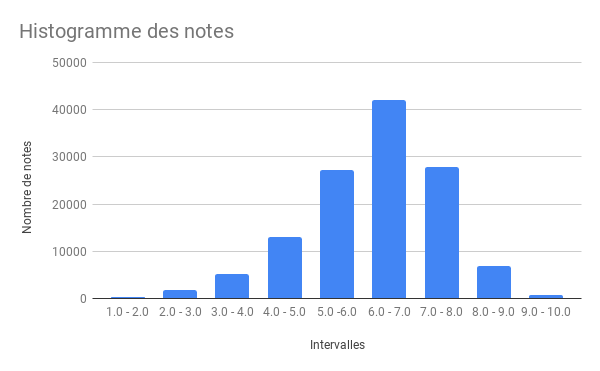

# BDAProject

## Description du dataset

Le dataset choisit vient de IMdB qui est un site notant et donnant des avis sur
des films et des séries. Ce dataset fournit des informations concernant les titres, les membres de l'équipe réalisant les films et
séries, concernant les épisodes en cas de séries, concernant les acteurs et concernant les votes attribués par le
site.

[Imdb Dataset](https://www.imdb.com/interfaces/)

Nous n'allons pas utiliser l'intégralité du dataset fournit pas IMdB, nous allons nous concentrer sur les éléments suivants :

* title.basics.tsv.gz : Contient les titres des films ainsi que les informations de base
* title.crew.tsv.gz : Contient l'équipe du film
* title.principals.tsv.gz : Contient les acteurs principaux
* title.ratings.tsv.gz : Contient les notes de chaque film

Au total, la taille des fichiers font environ 2,2 Giga.

## Analyse des données

Notre objectif est de parvenir à prédire la note d'un film en se basant sur les features du dataset.

Nous allons tester d'atteindre cet objectif avec de l'apprentissage supervisé et non-supervisé.

## Extraction des données

Nous allons premièrement utiliser les fichiers suivants :

* title.basics.tsv qui contient 5'844'181 entrées.
* title.ratings.tsv qui contient 931'150 entrées.
* title.crew.tsv qui contient 5'844'238 entrées.

A noter toutes fois que ces nombres d'entrée correspondes à tous les types de contenu que répertorie cette base de données. En plus des films, le point d'intérêt de ce projet, on a par exemple les séries. Il a donc fallu sélectionner uniquement les entrée liées à des films.

Afin d'assembler ces trois fichiers, nous avons réalisé des joins.

- Premièrement en joignant basic et ratings qui retourne un dataframe de 233'473 entrées (dataframe contenant encore des nulls).
- Puis nous joignons ce précédent résultat avec le dataframe des ratings. Ce qui diminue le nombre d'entrées à 233'472.
- Il faut cependant supprimer les lignes contenant des nulls. Ce qui fait qu'après avoir supprimé ces derniers, il reste 198'529 entrées.

Nous avons désormais un dataframe propre et prêt à être pré-processé.

Nous avons du cependant auparavant faire quelques choix sur quelles caractéristiques garder. Nous avons donc fait quelques statistiques. 

__Schéma du dataframe obtenu__

```
root
 |-- primaryTitle: string (nullable = true)
 |-- isAdult: string (nullable = true)
 |-- startYear: string (nullable = true)
 |-- runtimeMinutes: string (nullable = true)
 |-- averageRating: string (nullable = true)
 |-- tconst: string (nullable = true)
 |-- director1: string (nullable = true)
 |-- director2: string (nullable = false)
 |-- director3: string (nullable = false)
 |-- director4: string (nullable = false)
 |-- writer1: string (nullable = true)
 |-- writer2: string (nullable = false)
 |-- writer3: string (nullable = false)
 |-- writer4: string (nullable = false)
 |-- writer5: string (nullable = false)
 |-- genre1: string (nullable = true)
 |-- genre2: string (nullable = false)
 |-- genre3: string (nullable = false)
```

__Les genres__

Nous souhaitions savoir combien de genres possibles au plus il y avait par films.

Nous avons donc du spliter le contenu de la colonne `genres`. Nous avons pu voir qu'après cette étape, il y avait au plus 3 genres par films. 

Nous avons donc affiché le nombre de films ayant respectivement, un, deux et trois genres.


__Les réalisateurs & scénaristes__

Dans le fichier title.crew on peut trouver les informations sur les réalisateurs et les scénaristes qui on participé à un film en particulier. 

Nous avons alors, dans un premier temps et comme dans l'approche des genres, chercher à trouver le nombre maximum de réalisateurs et de scénaristes pour un film. Seulement il c'est avéré que ces nombres étaient bien trop haut (90 réalisateurs). Créer autant de features que le nombre maximum de réalisateurs (respectivement de scénaristes) n'était donc pas une approche adaptée.

Il faut donc chercher le nombre idéal de réalisateurs/scénaristes pour ensuite les transformer en features. On sait que certains films vont être laisser pour compte car ils ont trop de réalisateurs/scénaristes comme expliqué au paragraphe précédent. On a trouvé ce nombre idéal en générant des histogrammes cherchant à trouver combien de films seraient laisser pour compte si on utilisait un certain nombre de réalisateurs/scénaristes.


__Histogramme des notes__

Ci-dessous, l'histogramme des notes des données d'entraînement, on remarque que la majorité des notes se trouvent entre 5 et 8.



## Comparaison des modèles 

Comme le projet est très exploratoir, qu'on ne sait pas exactement à quels résultats s'attendre, on a décider de tester le plus de modèles possibles et de les comparer.Pour rendre plus efficace la mise en place de tous ces modèles on utilise les piplines de spark-ml qui va nous permettre de préparer de façon structuré la mise en place de chaque modèle y compris ses hypers paramètres. 

Les modèles comparés sont les suivants, ils représentent la quasi-totalité des modèles de regressions disponible avec spark-ml. La performance de chacun des modèles a été déterminer en utilisant la mse, la *mean squared error*.

| Model name                       |MSE |
|----------------------------------|-|
| Linear Regression                |1.40|
| Generalized Linear Regression    |1.40|
| Decision Tree Regression         |1.34|
| Random Forest Regression         |1.29|
| Isotonic Regression              |1.81|
| Gradient Boosted Tree Regression |-|

Nous n'avions toutefois pas de moyen de déterminer si les résultats obtenus étaient bons ou non. C'est pour celà qu'on a décidé d'étudier le comportement de différentes métriques avec des valeurs de prédictions arbitraires. Un fois cette étude menée nous serons capables de savoir à quel point notre modèle apporte quelque chose en plus qu'une prédiction aléatoire par exemple.

__Etdues des métriques__

Après avoir obtenu les premiers scores en entraînant nos modèles il a été jugé pertinent de comparer quel performance aurait été obtenu avec des modèles très simple (aléatoire ou à prédiction constante). 

|approch|mse|mae|r2|rmse|
|-|-|-|-|-|
|Random|11.39|2.80|-5.89|3.37|
|Zero|39.85|6.18|-23.10|6.31|
|Five|3.05|1.49|-0.84|1.75|
|Median|1.67|1.00|-0.01|1.29|


Les approches de prédictions sont écritent dans le tableau dans l'ordre dans lequel elles ont été testées. Premièrement on a cherché à faire des prédictions avec des valeurs aléatoires entre 0 et 10 les valeurs était plutôt grandes et il semblait probable qu'une approche différente donne de meilleur résultats. Ces meilleurs résultats nous les avons obtenus en prédisant toujours la valeur 5 pour chaque entrée. Et si on analyse l'histogramme des notes ça semble relativement logique. Les notes sont principalement concentrées entre 5 et 7 donc prédire tout le temps une valeur dans cet interval augmente les chances de faire une prédiction relativement correcte. On valide cette hypothèse avec la dernière étape, on ne prédit maintenant plus que la médiane du set de ratings. Le réaultat est encore fortement réduite. 

Cependant on remarque que la quasi-totalité de nos modèles ont des meilleurs résultats que cette prédiction utilisant uniquement la médiane. Même si la différence n'est pas énorme on peut donc en conclure que nos modèles sont suppérieur que des approches simplistes. Mais pour analyser plus précisément leur comportement il serait intéressant de mener une analyse concrète sur un certain subset de films.

__Test de cas concrets__

Pour avoir une idée plus concrète des performances de nos modèles on a décidés de mettre à part certains films. Après les avoirs mis à part on les utiliseraient comme deuxième set de test. Les films ont été sélectionners parmis les meilleurs et les pire de l'intégralité de la base de donnée de Imdb. On a utilisé deux classement (respectivement des meilleurs et pires films) mis en place par Imdb eux-même.

On a donc fait une prédiction avec chacun des modèles mis en place sur ce sous-ensemble de 6 films au total. On a bien sur pris soin de ne pas les inclures dans l'ensemble d'entraînement. Avoir des films avec des ratings si différents les uns des autres nous a permis de vérifier si les modèles étaient bien capables de classer un film comme bon ou mauvais. Dans l'ensemble c'est possible, les 3 mauvais films ont des prédictions plus basse que les 3 bons films mais la différence n'est pas autant grande qu'en réalité. Les modèles n'arrivent ensuite pas à séparer les bons/mauvais films entre eux quand. 

Le tableau ci-dessous illustre les prédictions du random forest. Pour rappel c'est le modèle avec la plus petit mse. On remarque une claire séparation entre les films bons et mauvais mais ensuite il n'y a pas de réel cohérence par rapport au rating original. 

|id       |ratings|prediction       |
|---------|-------|-----------------|
|tt0119217|8.3    |6.576423983134677|
|tt0926129|3.9    |4.851917823482771|
|tt0060666|1.9    |5.213862682478526|
|tt1213644|1.9    |5.679974565475559|
|tt0111161|9.3    |6.760429614171793|
|tt0068646|9.2    |6.636440864098387|


__K-Means__

Pour K-Means, nous avons fait tourné l'algorithme avec 10 clusters et nous avons fait des statistiques sur les notes contenues dans chaque cluster. Voici un tableau contenant :

* La note minimum du cluster
* La note maximum du cluster
* La moyenne du cluster
* L'écart type du cluster

La colonne "prediction" correspond aux numéros du cluster.

``` text
+------------------+----------+------------+-------------------+------------+
|      avg(ratings)|prediction|min(ratings)|stddev_pop(ratings)|max(ratings)|
+------------------+----------+------------+-------------------+------------+
|6.3917950180642435|         0|         1.0|  0.979701860714243|         9.5|
| 5.755560224089644|         1|         1.0|  1.389918143364063|         9.8|
|  5.77104160431008|         2|         1.0| 1.3150526402535503|        10.0|
| 7.067046602221895|         3|         1.0| 1.1806178577485784|        10.0|
|  5.28663857959674|         4|         1.0| 1.3823482827718772|         9.4|
| 6.391406791406788|         5|         1.0|  1.165642589116651|         9.8|
| 5.900535868625755|         6|         1.5| 1.1351725974796394|         9.2|
| 6.131306259158459|         7|         1.0| 1.0296355122250407|         9.0|
| 6.430731728363079|         8|         1.0| 1.1090194123005181|         9.8|
| 5.942283781312849|         9|         1.0| 1.2260331264703557|         9.2|
+------------------+----------+------------+-------------------+------------+
```

Voici une liste contenant la note la plus représentée de chaque cluster :

``` text
Cluster : 0      Rating : 6.0
Cluster : 1      Rating : 5.0
Cluster : 2      Rating : 6.0
Cluster : 3      Rating : 7.0
Cluster : 4      Rating : 5.0
Cluster : 5      Rating : 6.0
Cluster : 6      Rating : 6.0
Cluster : 7      Rating : 6.0
Cluster : 8      Rating : 6.0
Cluster : 9      Rating : 6.0
```

Avec ces statistiques, on remarque que les clusters ne correspondent pas à une note pour plusieurs raisons :

* Les notes les plus représentées sont entre 5 et 7 pour tous les clusters. Et si on observe les histogrammes de chaque cluster, ils ont la même forme que l'histogramme général.
* Les clusters possède la quasiment la même note minimum et maximum.
* Les moyennes des clusters sont très proches les une des autres.
