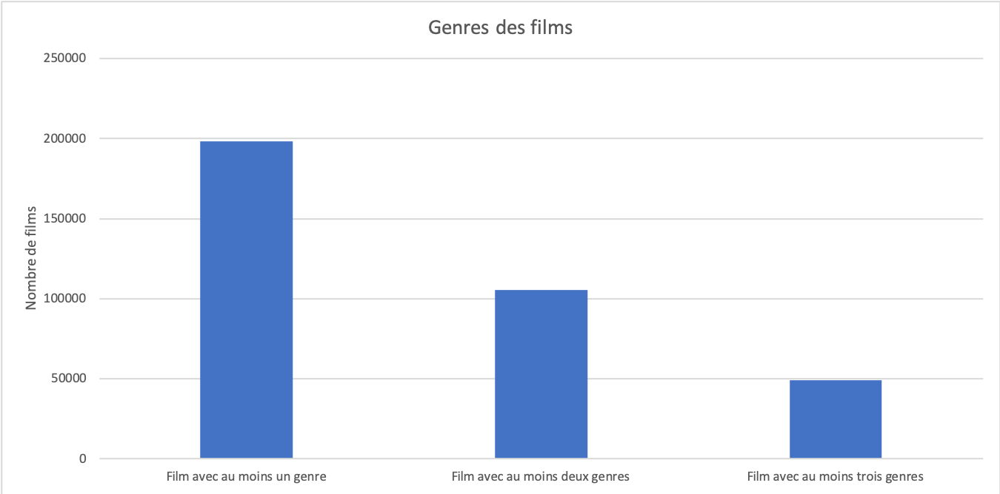
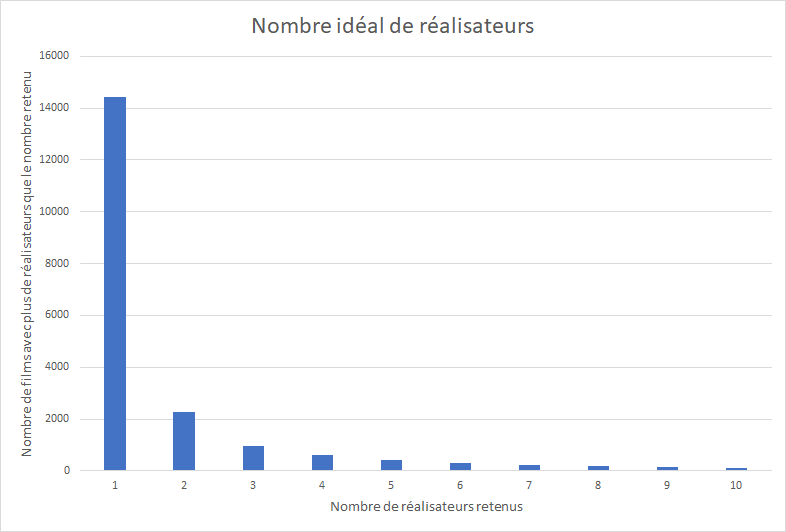
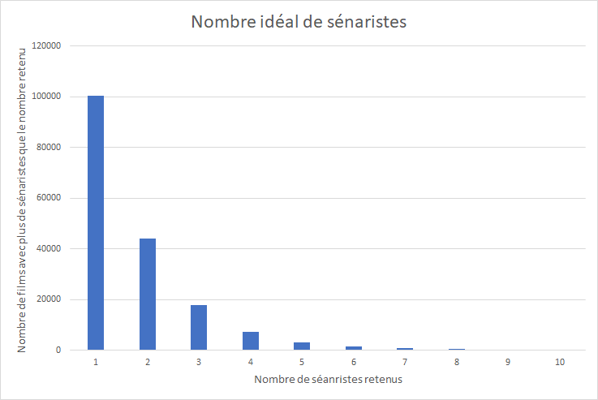

# BDAProject

## Description du dataset

Le dataset choisit vient de IMdB qui est un site notant et donnant des avis sur
des films et des séries. Ce dataset fournit des informations concernant les titres, les membres de l'équipe réalisant les films et
séries, concernant les épisodes en cas de séries, concernant les acteurs et concernant les votes attribués par le
site.

[Imdb Dataset](https://www.imdb.com/interfaces/)

Nous n'allons pas utiliser l'intégralité du dataset fournit pas IMdB, nous allons nous concentrer sur les éléments suivants :

* title.basics.tsv.gz : Contient les titres des films ainsi que les informations de base
* title.crew.tsv.gz : Contient l'équipe du film
* title.principals.tsv.gz : Contient les acteurs principaux
* title.ratings.tsv.gz : Contient les notes de chaque film

Au total, la taille des fichiers font environ 2,2 Giga.

## Analyse des données

Notre objectif est de parvenir à prédire la note d'un film en se basant sur les features du dataset.

Nous allons tester d'atteindre cet objectif avec de l'apprentissage supervisé et non-supervisé.

## Extraction des données

Nous allons premièrement utiliser les fichiers suivants :

* title.basics.tsv qui contient 5'844'181 entrées.
* title.ratings.tsv qui contient 931'150 entrées.
* title.crew.tsv qui contient 5'844'238 entrées.

A noter toutes fois que ces nombres d'entrée correspondes à tous les types de contenu que répertorie cette base de données. En plus des films, le point d'intérêt de ce projet, on a par exemple les séries. Il a donc fallu sélectionner uniquement les entrée liées à des films.

Afin d'assembler ces trois fichiers, nous avons réalisé des joins.

- Premièrement en joignant basic et ratings qui retourne un dataframe de 233'473 entrées (dataframe contenant encore des nulls).
- Puis nous joignons ce précédent résultat avec le dataframe des ratings. Ce qui diminue le nombre d'entrées à 233'472.
- Il faut cependant supprimer les lignes contenant des nulls. Ce qui fait qu'après avoir supprimé ces derniers, il reste 198'529 entrées.

Nous avons désormais un dataframe propre et prêt à être pré-processé.

Nous avons du cependant auparavant faire quelques choix sur quelles caractéristiques garder. Nous avons donc fait quelques statistiques. 

__Schéma du dataframe obtenu__

```
root
 |-- primaryTitle: string (nullable = true)
 |-- isAdult: string (nullable = true)
 |-- startYear: string (nullable = true)
 |-- runtimeMinutes: string (nullable = true)
 |-- averageRating: string (nullable = true)
 |-- tconst: string (nullable = true)
 |-- director1: string (nullable = true)
 |-- director2: string (nullable = false)
 |-- director3: string (nullable = false)
 |-- director4: string (nullable = false)
 |-- writer1: string (nullable = true)
 |-- writer2: string (nullable = false)
 |-- writer3: string (nullable = false)
 |-- writer4: string (nullable = false)
 |-- writer5: string (nullable = false)
 |-- genre1: string (nullable = true)
 |-- genre2: string (nullable = false)
 |-- genre3: string (nullable = false)
```

__Les genres__

Nous souhaitions savoir combien de genres possibles au plus il y avait par films.

Nous avons donc du spliter le contenu de la colonne `genres`. Nous avons pu voir qu'après cette étape, il y avait au plus 3 genres par films. 

Nous avons donc affiché le nombre de films ayant respectivement, un, deux et trois genres.



__Les réalisateurs & scénaristes__

Dans le fichier title.crew on peut trouver les informations sur les réalisateurs et les scénaristes qui on participé à un film en particulier. 

Nous avons alors, dans un premier temps et comme dans l'approche des genres, chercher à trouver le nombre maximum de réalisateurs et de scénaristes pour un film. Seulement il c'est avéré que ces nombres étaient bien trop haut (90 réalisateurs). Créer autant de features que le nombre maximum de réalisateurs (respectivement de scénaristes) n'était donc pas une approche adaptée.

Il faut donc chercher le nombre idéal de réalisateurs/scénaristes pour ensuite les transformer en features. On sait que certains films vont être laisser pour compte car ils ont trop de réalisateurs/scénaristes comme expliqué au paragraphe précédent. On a trouvé ce nombre idéal en générant des histogrammes cherchant à trouver combien de films seraient laisser pour compte si on utilisait un certain nombre de réalisateurs/scénaristes.




