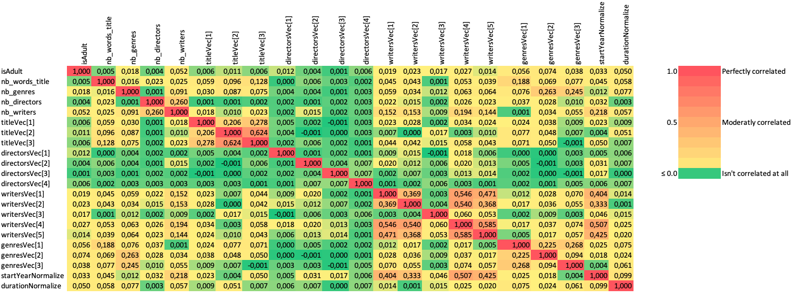

# BDAProject

## Intoduction

Dans le cadre du projet de Big Data Analysis, il nous a été demandé de réaliser un projet. Nous devions trouver nous même le but de ce projet en ayant pour unique but de devoir traiter une grande quantité de données.

Nous avons donc choisi d'utiliser le dataset d'IMdB et d'y appliquer des algorithmes de machine learning afin de faire de la régression en prédisant les notes des films qui ont été données par les utilisateurs du site.

## Description du dataset

Le dataset choisit vient de IMdB qui est un site notant et donnant des avis sur
des films et des séries. Ce dataset fournit des informations concernant les titres, les membres de l'équipe réalisant les films et
séries, concernant les épisodes en cas de séries, concernant les acteurs et concernant les votes attribués par le
site.

[Imdb Dataset](https://www.imdb.com/interfaces/)

Nous n'allons pas utiliser l'intégralité du dataset fournit pas IMdB, nous allons nous concentrer sur les éléments suivants :

* title.basics.tsv.gz : Contient les titres des films ainsi que les informations de base
* title.crew.tsv.gz : Contient l'équipe du film
* title.principals.tsv.gz : Contient les acteurs principaux
* title.ratings.tsv.gz : Contient les notes de chaque film

Au total, la taille des fichiers fait environ 2,2 Gb.

## Analyse

Notre objectif est de parvenir à prédire la note d'un film en se basant sur les features du dataset.

Nous allons tester d'atteindre cet objectif avec de l'apprentissage supervisé et non-supervisé.

### Extraction des données

Nous allons premièrement utiliser les fichiers suivants :

* title.basics.tsv qui contient 5'844'181 entrées.
* title.ratings.tsv qui contient 931'150 entrées.
* title.crew.tsv qui contient 5'844'238 entrées.

A noter toutes fois que ces nombres d'entrée correspondes à tous les types de contenu que répertorie cette base de données. En plus des films, le point d'intérêt de ce projet, on a par exemple les séries. Il a donc fallu sélectionner uniquement les entrée liées à des films.

Afin d'assembler ces trois fichiers, nous avons réalisé des joins.

- Premièrement en joignant basic et ratings qui retourne un dataframe de 233'473 entrées (dataframe contenant encore des nulls).
- Puis nous joignons ce précédent résultat avec le dataframe des ratings. Ce qui diminue le nombre d'entrées à 233'472.
- Il faut cependant supprimer les lignes contenant des nulls. Ce qui fait qu'après avoir supprimé ces derniers, il reste 198'529 entrées.

Nous avons désormais un dataframe propre et prêt à être pré-processé.

```
root
 |-- primaryTitle: string (nullable = true)
 |-- isAdult: string (nullable = true)
 |-- startYear: string (nullable = true)
 |-- runtimeMinutes: string (nullable = true)
 |-- averageRating: string (nullable = true)
 |-- tconst: string (nullable = true)
 |-- director1: string (nullable = true)
 |-- director2: string (nullable = false)
 |-- director3: string (nullable = false)
 |-- director4: string (nullable = false)
 |-- writer1: string (nullable = true)
 |-- writer2: string (nullable = false)
 |-- writer3: string (nullable = false)
 |-- writer4: string (nullable = false)
 |-- writer5: string (nullable = false)
 |-- genre1: string (nullable = true)
 |-- genre2: string (nullable = false)
 |-- genre3: string (nullable = false)
```

Cependant, après avoir commencé à préparer les données. Nous nous sommes rendus compte que le schéma actuel de notre dataframe n'était pas du tous adapté et nécessitait d'être repensé.

En effet, pour pouvoir utiliser l'outil Word2Vec, il est nécessaire que les colonnes contiennent des tableaux de String. *Non pas plusieurs colonnes de String !*

Nous avons donc utilisé un map, ce qui nous a permis de formater facilement nos données et avoir en moins de lignes un dataframe propre et dont le schéma est plus apte à la préparation des données.

```scala
.map {
    case Row(id: String, title: String, isAdult: String, startYear: String, duration: String, genres: String,
    ratings: String, directors: String, writers: String) =>
      (id,
        parse_string(title.replaceAll("[^A-Za-z0-9 ]", ""), ' ').length,
        parse_string(title.replaceAll("[^A-Za-z0-9 ]", ""), ' '),
        isAdult.toInt, startYear, duration,
        parse_string(genres, ',').length,
        parse_string(genres, ','),
        ratings.toDouble,
        parse_string(directors, ',').length,
        parse_string(directors, ',').slice(0, 4),
        parse_string(writers, ',').length,
        parse_string(writers, ',').slice(0, 5))
```

Vous pouvez voir que nous avons ajouter la taille des tableaux de strings pour les features. Ce choix vient du fait que cela aide très souvent les modèles à avoir de meilleurs résultats de connaitre la taille de ce genre de données. Dans notre cas, les résultats ne seront pas drastiquement différent. Nous avons tous de même décidé de laisser ces features en plus car elles ne peuvent que mieux décrire notre dataset et ne réduisent pas le score de nos modèles.

Nous obtenons donc le schéma suivant.

```
root
 |-- id: string (nullable = true)
 |-- nb_words_title: integer (nullable = true)
 |-- title: array (nullable = true)
 |    |-- element: string (containsNull = true)
 |-- isAdult: integer (nullable = true)
 |-- startYear: string (nullable = true)
 |-- duration: string (nullable = true)
 |-- nb_genres: integer (nullable = true)
 |-- genres: array (nullable = true)
 |    |-- element: string (containsNull = true)
 |-- ratings: double (nullable = true)
 |-- nb_directors: integer (nullable = true)
 |-- directors: array (nullable = true)
 |    |-- element: string (containsNull = true)
 |-- nb_writers: integer (nullable = true)
 |-- writers: array (nullable = true)
 |    |-- element: string (containsNull = true)
```

__Stockage__

Afin de n'avoir pas à refaire l'extraction des données chaque fois que nous voulions tester quelque chose. Nous avons décidé de stocker notre dataframe afin de l'utiliser pour la préparation des données.

Pour cela, nous avons utilisé ce qui s'appelle des `parquet`. Ces derniers sont un moyen de sauvegarder facilement des dataframes depuis spark. 

```scala
df_basics_crew_ratings.write.mode(SaveMode.Overwrite).parquet("features_extract.parquet")
```

De cette manière, il suffit en suite d'importer notre dataframe `features_extract` et de l'utiliser comme à la normale.

```scala
var features = spark.read.parquet("features_extract.parquet")
```

### Préparation des données

Maintenant que nous avons un dataframe contenant l'extraction de nos films. Il nous faut adapter ces données pour des modèles de regression. En effet, ces derniers ne peuvent pas utiliser des données avec du texte brut tel quel. Il est nécessaire de nettoyer ces données dans un premier temps, d'enlever les mots inutiles (stop words) et de finalement les transformer en vecteur grâce à l'outil Word2Vec. Pour les valeurs qui sont déjà numériques, il faut les normaliser afin que celles-ci n'aient pas un poids trop élevé par rapport aux autres.

__Nettoyage__

Les titre contenait des caractères spéciaux comme des points virgules, des points d'exclamation, des virgules, etc... Nous n'avons pas besoin d'utiliser tous ces caractères qui ne feraient que d'ajouter du bruit. Nous avons donc utiliser une fonction utilisant du regex pour nettoyer nos titres.

```scala
title.replaceAll("[^A-Za-z0-9 ]", "")
```

Cette ligne permet donc d'effacer tous ces caractères spéciaux (espaces compris) pour les remplacer par "" (rien).

__Stop Words__

Les stops words sont des mots tels que : __the, or, not, in, if, for, etc...__. Ce sont des mots qui n'ont pas de grandes utilité dans la représentation de la signification des titres. C'est pour cela que nous utilisons un outil de spark ml qui va les enlever pour nous.

```scala
val remover = new StopWordsRemover()
    .setInputCol("title")
    .setOutputCol("titleStopWords")
```

De ce fait, avec le titre `The Grand Duchess and the Waiter`, nous obtenons le nouveau titre `Grand Duchess Waiter`.

__Word2Vec__

L'outil Word2Vec va projeté la signifaction d'un mot en fonction de son context dans un espace vectoriel multi-dimentionnel. Ce qui nous permet d'avoir des mots semblables qui auront des vecteurs semblables.

Voici ci-dessous le code de notre fonction permettant d'utiliser Word2Vec.

``` scala
def vectorize(dataFrame: DataFrame, inputCol: String, outputCol: String, size: Int): DataFrame = {
  val word2Vec = new Word2Vec()
    .setInputCol(inputCol)
    .setOutputCol(outputCol)
    .setVectorSize(size)
    .setMinCount(0)
  val model = word2Vec.fit(dataFrame)

  model.transform(dataFrame)
}
```

Nous pouvons voir qu'il est nécessaire d'indiquer la taille de nos vecteurs qui encoderont nos mots. Nous ne pouvons pas définir ces tailles de façon aléatoire. Nous allons donc devoir utiliser des preuves scientifiques pour définir la bonne taille de ces derniers.

Avant cela, regardons tous de même un exemple de vectorisation d'un titre.

Reprenons notre titre `The Grand Duchess and the Waiter` qui est désormais devenu `Grand Duchess Waiter`, en le passant par notre fonction, nous obtenons le vecteur `[0.024120589718222618,0.04724174862106641,0.06002357602119446]`.

Nous avons codé les titres sur 3 bits car nous avons calculé que la moyenne de la longueur des titres de films était à 2.3, nous l'avons donc arrondie à 3 afin d'englober les titres à peine plus long. De plus, après avoir testé avec des titres encodés sur 2 bits, les résultats étaient moins bons. Ce qui nous conforte dans l'idée d'encoder les titres sur 3 bits.

__Les genres__

Désormais, il nous fallait savoir quel serait la taille des vecteurs des genres. Pour cela, nous avons voulu savoir combien de genres il y avait au plus pour tous les films.

Nous avons calculer le nombre de films ayant un genre, puis deux et enfin trois. Nous avons donc obtenus le graphe suivant.


Nous en avons conclu que nous arrivions à englober tous les films en encodant le vecteur sur 3 bits car aucun film n'a de 4 ème genre.

__Les réalisateurs & scénaristes__

Dans le fichier title.crew on peut trouver les informations sur les réalisateurs et les scénaristes qui on participé à un film en particulier. 

Nous avons alors, dans un premier temps et comme dans l'approche des genres, chercher à trouver le nombre maximum de réalisateurs et de scénaristes pour un film. Seulement il s'est avéré que ces nombres étaient bien trop haut (90 réalisateurs). Créer autant de features que le nombre maximum de réalisateurs (respectivement de scénaristes) n'était donc pas une approche adaptée.

Il faut donc chercher le nombre idéal de réalisateurs/scénaristes pour ensuite les transformer en features. On sait que certains films vont être laisser pour compte car ils ont trop de réalisateurs/scénaristes comme expliqué au paragraphe précédent. On a trouvé ce nombre idéal en générant des histogrammes cherchant à trouver combien de films seraient laisser pour compte si on utilisait un certain nombre de réalisateurs/scénaristes.


Nous avons donc conclu grâce aux précédents graphes que nous englobions un nombre suffisant de films en utilisant des vecteurs de 4 pour les directeurs et de 5 pour les scénaristes.

__Corrélation des features__

Maintenant que nos données sont propres et vectorisée, nous pouvons les utiliser dans nos modèles. Cependant, nous souhaiterions vérifier la corrélation des features avant de les utiliser. Cette corrélation pourrait nous indiquer si une feature est trop proche d'une autre et que son utilité est donc moindre.

Nous avons, pour cela, utilisé l'objet Correlation de spark.

```scala
val Row(coeff1: Matrix) = Correlation.corr(df_, "features").head
```

Nous obtenons le résultat suivant.



Grâce à cette matrice, nous pouvons en conclure qu'à part une légère correlation entre les scénaristes et l'année de réalisation du film, nos features ne sont pas correlées entre elles. Ce qui est bon signe et indique qu'elles ont chacune leur importance.

Nous pouvons passer sans craintes à la comparaison des modèles.

## Comparaison des modèles 

Comme le projet est très exploratoire, qu'on ne sait pas exactement à quels résultats s'attendre, on a décidé de tester le plus de modèles possibles et de les comparer.Pour rendre plus efficace la mise en place de tous ces modèles on utilise les piplines de spark-ml qui va nous permettre de préparer de façon structuré la mise en place de chaque modèle y compris ses hypers paramètres. 

### Modèles supervisés

Les modèles comparés sont les suivants, ils représentent la quasi-totalité des modèles de regressions disponible avec spark-ml. La performance de chacun des modèles a été déterminée en utilisant la mse - *mean squared error*, la rmse - *root mean square error*, la mae - *mean absolute error*, la r2 *le coefficient de détermination non ajusté*. 

| Model name                       |MSE|RMSE|MAE|r2|
|----------------------------------|-|-|-|-|
| Linear Regression                |1.40|1.18|0.92|0.15|
| Generalized Linear Regression    |1.40|1.18|0.92|0.15|
| Decision Tree Regression         |1.34|1.15|0.89|0.18|
| Random Forest Regression         |1.29|1.13|0.87|0.22|
| Isotonic Regression              |1.81|1.37|1.01|-0.13|
| Gradient Boosted Tree Regression |-|-|0.88|-|

Nous n'avions toutefois pas de moyen de déterminer si les résultats obtenus étaient bons ou non. C'est pour celà qu'on a décidé d'étudier le comportement de différentes métriques avec des valeurs de prédictions arbitraires. Un fois cette étude menée nous serons capables de savoir à quel point notre modèle apporte quelque chose en plus qu'une prédiction aléatoire par exemple.

En analysant l'histogramme (voir chapitre histogramme des notes) des notes on réalise que l'on a un ensemble de données non uniformément distribué. Il existe des modèles moins sensible à cette problématique comme par exemple les modèles Bayasiens. Implémenter un modèle Bayasien pourrait augmenter les performances de regression. Mais il n'existe pas de tel modèle dans spark-ml pour l'instant et il n'est pas non plus possible de paramétrer un modèle pour utiliser par exemple un noyau bayasien. 

__Etudes des métriques__

Après avoir obtenu les premiers scores en entraînant nos modèles il a été jugé pertinent de comparer quel performance aurait été obtenu avec des modèles très simple (aléatoire ou à prédiction constante). 

|approch|mse|mae|r2|rmse|
|-|-|-|-|-|
|Random|11.39|2.80|-5.89|3.37|
|Zero|39.85|6.18|-23.10|6.31|
|Five|3.05|1.49|-0.84|1.75|
|Median|1.67|1.00|-0.01|1.29|


Les approches de prédictions sont écritent dans le tableau dans l'ordre dans lequel elles ont été testées. Premièrement on a cherché à faire des prédictions avec des valeurs aléatoires entre 0 et 10 les valeurs était plutôt grandes et il semblait probable qu'une approche différente donne de meilleur résultats. Ces meilleurs résultats nous les avons obtenus en prédisant toujours la valeur 5 pour chaque entrée. Et si on analyse l'histogramme des notes ça semble relativement logique. Les notes sont principalement concentrées entre 5 et 7 donc prédire tout le temps une valeur dans cet interval augmente les chances de faire une prédiction relativement correcte. On valide cette hypothèse avec la dernière étape, on ne prédit maintenant plus que la médiane du set de ratings. Le réaultat est encore fortement réduite. 

Cependant on remarque que la quasi-totalité de nos modèles ont des meilleurs résultats que cette prédiction utilisant uniquement la médiane. Même si la différence n'est pas énorme on peut donc en conclure que nos modèles sont suppérieur que des approches simplistes. Mais pour analyser plus précisément leur comportement il serait intéressant de mener une analyse concrète sur un certain subset de films.

__Test de cas concrets__

Pour avoir une idée plus concrète des performances de nos modèles on a décidés de mettre à part certains films. Après les avoirs mis à part on les utiliseraient comme deuxième set de test. Les films ont été sélectionners parmis les meilleurs et les pire de l'intégralité de la base de donnée de Imdb. On a utilisé deux classement (respectivement des meilleurs et pires films) mis en place par Imdb eux-même.

On a donc fait une prédiction avec chacun des modèles mis en place sur ce sous-ensemble de 6 films au total. On a bien sur pris soin de ne pas les inclures dans l'ensemble d'entraînement. Avoir des films avec des ratings si différents les uns des autres nous a permis de vérifier si les modèles étaient bien capables de classer un film comme bon ou mauvais. Dans l'ensemble c'est possible, les 3 mauvais films ont des prédictions plus basse que les 3 bons films mais la différence n'est pas autant grande qu'en réalité. Les modèles n'arrivent ensuite pas à séparer les bons/mauvais films entre eux quand. 

Le tableau ci-dessous illustre les prédictions du random forest. Pour rappel c'est le modèle avec la plus petit mse. On remarque une claire séparation entre les films bons et mauvais mais ensuite il n'y a pas de réel cohérence par rapport au rating original. 

|id       |ratings|prediction       |
|---------|-------|-----------------|
|tt0119217|8.3    |6.576423983134677|
|tt0926129|3.9    |4.851917823482771|
|tt0060666|1.9    |5.213862682478526|
|tt1213644|1.9    |5.679974565475559|
|tt0111161|9.3    |6.760429614171793|
|tt0068646|9.2    |6.636440864098387|

__Histogramme des notes__

Ci-dessous, l'histogramme des notes des données d'entraînement, on remarque que la majorité des notes se trouvent entre 5 et 8.


### Modèle non-supervisé

__K-Means__

Pour K-Means, nous avons fait tourné l'algorithme avec 10 clusters et nous avons fait des statistiques sur les notes contenues dans chaque cluster. Voici un tableau contenant :

* La note minimum du cluster
* La note maximum du cluster
* La moyenne du cluster
* L'écart type du cluster

La colonne "prediction" correspond aux numéros du cluster.

``` text
+------------------+----------+------------+-------------------+------------+
|      avg(ratings)|prediction|min(ratings)|stddev_pop(ratings)|max(ratings)|
+------------------+----------+------------+-------------------+------------+
|6.3917950180642435|         0|         1.0|  0.979701860714243|         9.5|
| 5.755560224089644|         1|         1.0|  1.389918143364063|         9.8|
|  5.77104160431008|         2|         1.0| 1.3150526402535503|        10.0|
| 7.067046602221895|         3|         1.0| 1.1806178577485784|        10.0|
|  5.28663857959674|         4|         1.0| 1.3823482827718772|         9.4|
| 6.391406791406788|         5|         1.0|  1.165642589116651|         9.8|
| 5.900535868625755|         6|         1.5| 1.1351725974796394|         9.2|
| 6.131306259158459|         7|         1.0| 1.0296355122250407|         9.0|
| 6.430731728363079|         8|         1.0| 1.1090194123005181|         9.8|
| 5.942283781312849|         9|         1.0| 1.2260331264703557|         9.2|
+------------------+----------+------------+-------------------+------------+
```

Voici une liste contenant la note la plus représentée de chaque cluster :

``` text
Cluster : 0      Rating : 6.0
Cluster : 1      Rating : 5.0
Cluster : 2      Rating : 6.0
Cluster : 3      Rating : 7.0
Cluster : 4      Rating : 5.0
Cluster : 5      Rating : 6.0
Cluster : 6      Rating : 6.0
Cluster : 7      Rating : 6.0
Cluster : 8      Rating : 6.0
Cluster : 9      Rating : 6.0
```

Avec ces statistiques, on remarque que les clusters ne correspondent pas à une note pour plusieurs raisons :

* Les notes les plus représentées sont entre 5 et 7 pour tous les clusters. Et si on observe les histogrammes de chaque cluster, ils ont la même forme que l'histogramme général.
* Les clusters possède la quasiment la même note minimum et maximum.
* Les moyennes des clusters sont très proches les une des autres.

 K-Means a été testé avec les 2 mesures de distances proposé par Spark mais dans les 2 cas les résultats sont similaires.

## Conclusion

Un des grands problèmes que nous avons constatés sur nos données sont leur manque de balancement. En effet, en se basant sur l'histogramme des notes on remarque que les notes sont principalement répartient entre 5 et 7. Cepdenant les données non-balancées peuvent poser problème chez la grande majorité des modèles de regression. 

Une des famille de modèle qui ne serait pas sensible à ces données non balancées serait les modèles Bayasiens. Cependant, comme dit plus haut il n'existe pas aujourd'hui d'implémentation de modèle Bayasiens pour de la regression dans spark ml. La solution pourrait également passer par la mise en place d'une métrique d'évaluation personalisé à notre problématique, mais, d'après nos analyses, on ne peut pas implémenter de métriques personnalisés avec spark-ml.

Cependant, malgrés ce problème de balancement des données nous avons aussi pu constater que tous les modèles implémentés sont meilleurs que de l'aléatoire ou encore la prédiction arbitraire de la valeur médiane de l'ensemble des ratings.

Notre comparaison des modèles supervisés et non-supervisés nous on permit de déterminer que la créatrion de clusters ne passe pas par une séparation des films dans différents clusters de ratings. On peut donc en déduire que si l'on veut augmenter nos performances de régressions il serait préférable de continuer à utiliser principalement des modèles supervisés.

Il est finalement encore important de mentionner qu'il existe encore d'autres features qui pourrait être extraitent de l'ensemble de données. Par exemple, les acteurs qui représentent la plus grandes quantités de données n'ont pas été utilisés ici par manque de temps mais ils pourraient être utilisés de la même manière que les réalisateurs ou les scénaristes pour rajouter de nouvelles features.


